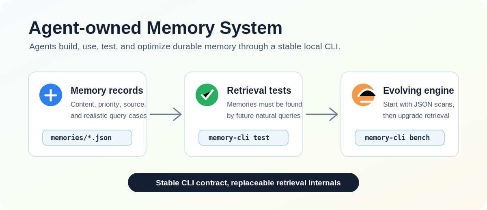
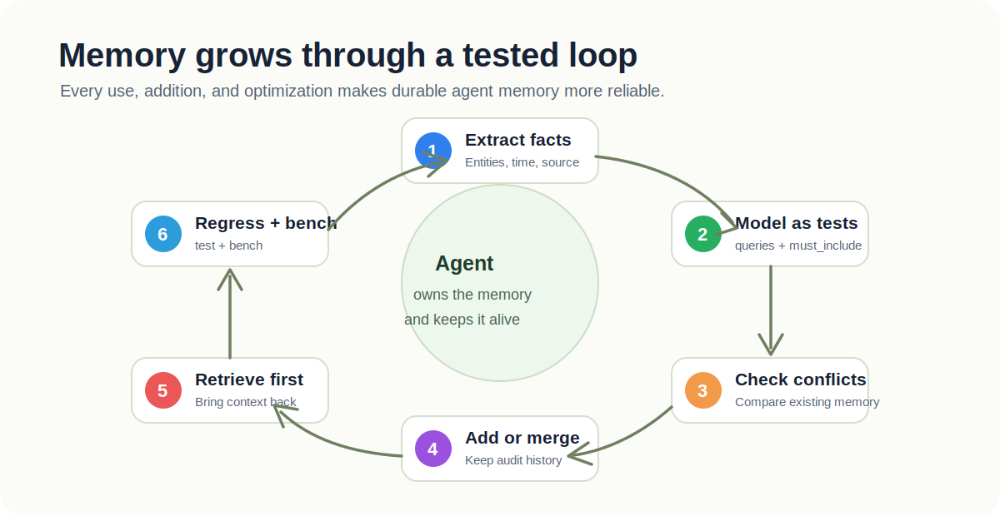
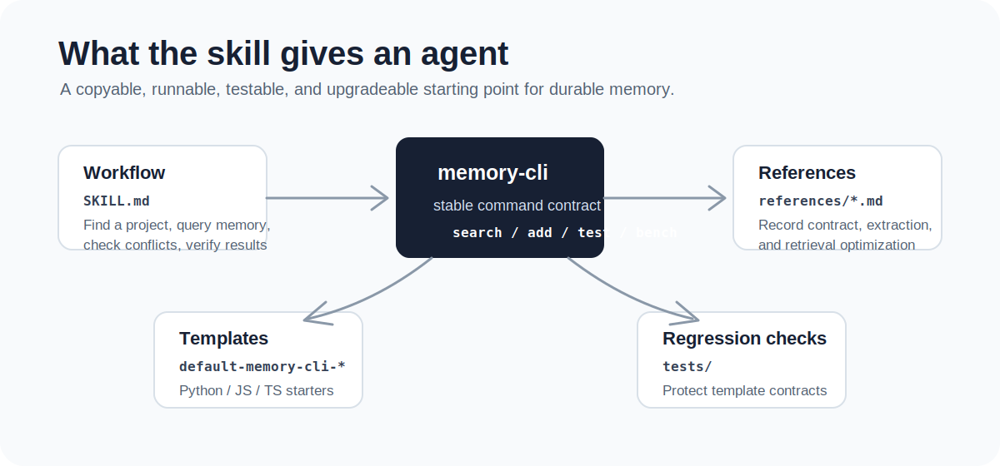

# Memory CLI Skill

[中文说明](README.zh.md)



This repository provides an agent-oriented memory system skill. It teaches an agent to build, use, test, and continuously improve a long-term memory system inside its own workspace, without prescribing one fixed database or retrieval backend.

The core idea is: memory is not just stored text; it is behavior that can be retrieved correctly later. Important memories enter the system with retrieval tests. Only when keywords and key phrases can find them again do they count as remembered.

## Installation

Install the skill with:

```bash
gh skill install pygent-ai/memory-cli
```

The skill is also packaged for npm distribution:

```bash
npm install @pygent-ai/memory-cli
```

The npm package includes a Codex plugin manifest at `.codex-plugin/plugin.json`
and the reusable skill under `skills/memory-cli`.

## Experiment Results

LongMemEval oracle experiments are documented in
`experiments/longmemeval/README.md`. Reported accuracy below is after manual or
semantic review of answers that strict substring matching can miss.

| Agent | Evaluated cases | Correct after review | Accuracy after review |
|---|---:|---:|---:|
| Codex | 500 / 500 | 468 | 93.60% |
| Cursor | 83 / 500 | 68 | 81.93% |

Strict substring scores were lower: Codex `336 / 500` (67.20%) and Cursor
`62 / 83` (74.70%). See the
[LongMemEval experiment README](experiments/longmemeval/README.md) for scope,
charts, and result-file links.

## Skill Package

`skills/memory-cli` is the core skill package in this repository. It contains the main skill instructions, three default project templates, reference documents, and an agent configuration example.

```text
docs/
  memory-system-design.md
  assets/
skills/
  memory-cli/
    SKILL.md
    agents/openai.yaml
    references/
      memory-test-contract.md
      memory-extraction-guide.md
      retrieval-optimization-guide.md
    assets/
      default-memory-cli-py/
      default-memory-cli-js/
      default-memory-cli-ts/
        memories/
        test-cases/
tests/
  test_skill_templates.py
```

The main skill file defines how an agent should work with this memory system:

- First look for an existing `memory-cli`, `.memory`, or `memory` project in the current workspace.
- If no project exists, copy the most suitable default template.
- Before tasks that may depend on durable context, query memory with `memory-cli search`.
- Before adding memory, write a candidate memory JSON file and check it with `check-conflicts`.
- After changing memories or retrieval logic, run `memory-cli test` and `memory-cli bench`.
- When correctness or performance breaks, fix the memory cases or retrieval implementation instead of weakening high-value memories.

## Default Templates

The repository includes three copyable starting points:

- `assets/default-memory-cli-py/`: Python + `uv`, suitable for fast setup and minimal dependencies.
- `assets/default-memory-cli-js/`: Node.js JavaScript, suitable for lightweight scripting environments.
- `assets/default-memory-cli-ts/`: Node.js TypeScript, suitable for projects that want type checking.

All three templates start with runtime JSON memory files, separate JSON retrieval test cases, and simple keyword matching. Early memory systems do not need elaborate architecture; they need a project that runs, can be tested, and can be understood by future maintainers.

## How Memory Grows



A healthy agent memory system follows a loop:

1. **Extract**: Identify facts worth retaining from tasks, conversations, documents, or code history.
2. **Model**: Write those facts as candidate memory records with runtime content plus `queries` and `must_include` assertions.
3. **Check conflicts**: Run candidate queries against existing memory, and ask the user or maintainer to decide when facts contradict each other.
4. **Add**: Add the memory after conflict checks pass. The default templates split runtime fields into `memories/` and retrieval assertions into `test-cases/`.
5. **Retrieve**: Query relevant memories before starting work so durable context returns to the task.
6. **Regress**: Run tests to confirm important memories can still be found by future keyword and key-phrase queries.
7. **Optimize**: Upgrade the internal implementation when test quality, retrieval speed, or recall begins to degrade.

The point is not to save more. The point is for each memory to participate in future behavior. As the memory system grows, the test suite grows with it.

## Command Contract

All templates are built around the same command surface:

```bash
memory-cli init [--path <dir>]
memory-cli search <keyword-or-key-phrase> [keyword-or-key-phrase...]
memory-cli check-conflicts --file <candidate.json>
memory-cli add --file <memory.json> [--force]
memory-cli list
memory-cli show <id>
memory-cli update <id> --file <updates.json>
memory-cli retire <id> [--reason <text>]
memory-cli test
memory-cli bench
```

This command surface should stay stable. An agent may replace JSON scanning with an inverted index, SQLite FTS, vector retrieval, or hybrid ranking, but the outer workflow should keep depending on the same commands and JSON output shape.

## Candidate Memory Files

A candidate memory file passed to `check-conflicts` or `add` contains at least these fields:

```json
{
  "id": "mem-stable-id",
  "priority": 80,
  "content": "The durable memory text.",
  "queries": ["keyword one", "key phrase two"],
  "must_include": ["required phrase"],
  "keywords": ["keyword one", "key phrase two"]
}
```

After `memory-cli add`, the default templates store runtime memory under `memories/` without `queries` or `must_include`, and store retrieval assertions under `test-cases/`:

```json
{
  "memory_id": "mem-stable-id",
  "priority": 80,
  "queries": ["keyword one", "key phrase two"],
  "must_include": ["required phrase"]
}
```

`memory-cli search` reads only runtime memories and runtime indexes. `memory-cli test` and `memory-cli bench` read `test-cases/` and call the public search path.

`priority` is operational, not decorative. It affects ranking, failure severity, and optimization priority:

```text
100 = identity, hard constraints, long-term user preferences
80  = important project decisions
60  = common habits and workflow preferences
40  = temporary but still useful context
20  = low-value historical notes
```

## Daily Agent Workflow



```bash
# After copying a template project, install or run it from the template directory.
uv tool install -e .

# Retrieve relevant durable context before starting work.
memory-cli search "memory skill" "retrieval tests"

# Check whether a candidate memory conflicts with existing memory.
memory-cli check-conflicts --file candidate.json

# Add the memory after conflict checks pass; add splits runtime data from test assertions.
memory-cli add --file memory.json

# Verify correctness and performance after changing memories or retrieval code.
memory-cli test
memory-cli bench
```

During template development, global installation is optional:

```bash
# Python
uv run memory-cli search "test driven memory"

# JavaScript
node src/cli.js search "test driven memory"

# TypeScript
npm install
npm test
```

## Development Verification

The current repository tests mainly check that the skill package and default templates keep their contracts aligned:

```bash
python -m unittest discover -s tests
```

When changing template paths, README template descriptions, `package.json` bin configuration, or test scripts, update tests and documentation together.
