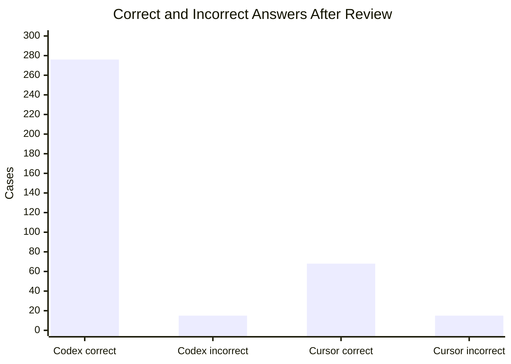
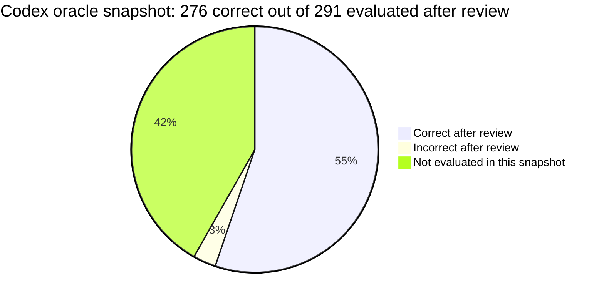
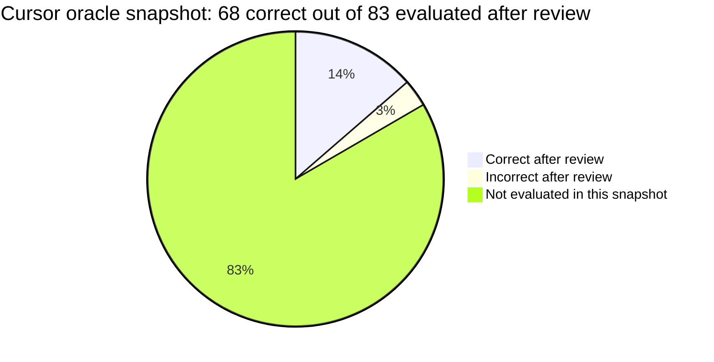

# LongMemEval Experiment Harness

This directory contains the LongMemEval experiment harness for evaluating a
`memory-cli` project built by an agent and then queried by a separate QA stage.

The harness is designed around one rule: the memory-building stage may see the
conversation history, the QA stage may see the question, and only evaluator
scripts may see the reference answer and evidence labels.

## Experiment Results

These are partial LongMemEval oracle snapshots, not a completed 500-case
benchmark. The main accuracy numbers below are after manual or semantic review
of answers that strict substring matching can miss. The denominator in the
accuracy columns is the number of evaluated cases with metrics, not all 500
oracle cases.

| Agent / snapshot | Evaluated cases | Correct after review | Incorrect after review | Reviewed accuracy | Dataset coverage |
|---|---:|---:|---:|---:|---:|
| Codex: `real-combined-291-latest` | 291 / 500 | 276 | 15 | 94.85% | 58.20% |
| Cursor: `cursor-oracle-500-qa83` | 83 / 500 | 68 | 15 | 81.93% | 16.60% |

Codex's raw strict substring score is 186 / 291 (63.92%). Manual review accepted
90 additional semantically correct answers and rejected 15, giving 276 / 291
(94.85%).

Cursor's raw strict substring score is 62 / 83 (74.70%). Review accepted 6
additional semantic-equivalent temporal reasoning answers, giving 68 / 83
(81.93%).







### Result Details

- Codex details:
  `experiments/longmemeval/results/real-combined-291-latest/RESULTS.md`
- Cursor details:
  `experiments/longmemeval/results/cursor-oracle-500-qa83/RESULTS.md`
- Cursor is an interim snapshot from `cursor-oracle-500-parallel`; only cases
  with completed QA and `outputs/metrics.json` are included.
- Codex review adjustment: 186 strict substring matches plus 90 manually
  accepted answers.
- Cursor review adjustment: 62 strict substring matches plus 6 semantically
  equivalent answers accepted after review.

## Current Data Flow

`scripts/codex/prepare_cases.py` splits each raw LongMemEval item into public stage
inputs and private evaluator data.

- `cases/<original_question_id>/memory_input.json`
  - Used only by the memory-building stage.
  - Contains sanitized `session_id`, timestamp, role, and content fields.
  - Does not contain the question, answer, `has_answer`, or evidence ids.

- `cases/<original_question_id>/question_input.json`
  - Used only by the QA stage.
  - Contains the question, question date, and a public `question_id`.
  - The public `question_id` is anonymized as `case_0001`, `case_0002`, and so
    on, so `_abs` and other raw-id labels are not leaked to the QA prompt.

- `private_eval/<original_question_id>.json`
  - Copied into a run case only after the QA stage has finished.
  - Contains the reference answer, answer evidence sessions, the raw
    `original_question_id`, and the public-to-raw session id map.

Generated case directories still use LongMemEval's original question ids so they
can be traced back to the source dataset. Agent-facing files use public ids.

## Run Stages

`scripts/codex/run_case.py` runs one case in two isolated stages.

1. The builder stage receives only `work/input/memory_input.json`.
2. The builder creates or updates `work/.memory` through the local
   `memory-cli` contract.
3. Before QA starts, the harness removes `work/input/memory_input.json` and
   copies in `work/input/question_input.json`.
4. The QA stage answers by calling `memory-cli search` against `work/.memory`.
5. The QA agent writes `outputs/answer.json`, including
   `search_queries_and_cli_results`.
6. The harness reruns every recorded QA `query` with `memory-cli search` and
   writes `outputs/retrieval.json`.
7. Only after retrieval is complete, the harness copies
   `private_eval_ref.json` and writes `outputs/metrics.json`.

The QA prompt asks for this answer shape:

```json
{
  "answer": "short final answer",
  "abstain": false,
  "search_queries_and_cli_results": [
    {
      "query": "exact query passed to memory-cli search",
      "cli_result_summary": "brief summary of the result used"
    }
  ],
  "rationale": "brief explanation based only on retrieved memories"
}
```

`retrieval.json` is therefore a harness artifact, not a free-form QA-agent
artifact. This keeps retrieval metrics tied to the actual CLI queries the QA
agent reported.

## Memory Records

LongMemEval source provenance is represented through the generic memory-cli
fields returned by all templates:

- `id`: for one-session memories, prefer the source session id, such as
  `session_0002`.
- `source`: for fused or semantic memories, include every source session id in a
  parseable form, such as `LongMemEval case_0001 session_0002 session_0005`.

The default templates should stay experiment-agnostic. They do not need a
LongMemEval-only `session_ids` output field. The experiment evaluator adapts the
generic `id` / `source` fields back to source session ids before computing
recall and NDCG.

## Smoke Run

Download the oracle split:

```powershell
experiments\longmemeval\scripts\codex\download_dataset.cmd --dataset oracle --out-dir datasets\longmemeval\raw
```

Prepare a small processed split:

```powershell
experiments\longmemeval\scripts\codex\prepare_cases.cmd --raw datasets\longmemeval\raw\longmemeval_oracle.json --out-dir datasets\longmemeval\processed\oracle --limit 3
```

Run the harness with mock agents:

```powershell
experiments\longmemeval\scripts\codex\run_all.cmd --processed-dir datasets\longmemeval\processed\oracle --cases smoke --limit 3 --run-id smoke-mock --mock-agents
```

Run one real Codex-agent case:

```powershell
experiments\longmemeval\scripts\codex\run_all.cmd --processed-dir datasets\longmemeval\processed\oracle --cases smoke --limit 1 --run-id smoke-real-1 --agent-command "codex exec --ephemeral --skip-git-repo-check" --agent-timeout-seconds 900
```

Run only the QA stage for an existing built case:

```powershell
experiments\longmemeval\scripts\codex\qa_stage.cmd experiments\longmemeval\runs\ut-build-case1\cases\gpt4_2655b836 "codex exec --ephemeral --skip-git-repo-check"
```

`codex exec` starts a new session for each normal invocation. `--ephemeral` is
recommended for experiments so the session is not persisted for later resume.

## Outputs

Runs are written under `experiments/longmemeval/runs/<run_id>/`.

Each case contains:

- `work/.venv`: per-case command environment and wrapper scripts.
- `work/.memory`: memory project created by the builder agent.
- `logs/build_agent.json`: builder command, stdout, stderr, and return code.
- `logs/qa_agent.json`: QA command, stdout, stderr, and return code.
- `outputs/answer.json`: normalized QA answer plus recorded search queries.
- `outputs/retrieval.json`: harness-rerun retrieval traces and latency.
- `outputs/manual_review.json`: optional human review override for semantically
  correct answers that fail strict substring matching.
- `outputs/metrics.json`: retrieval metrics, strict substring answer check, and
  final answer correctness after optional human review.
- `outputs/judge.json`: present only for mock runs or when
  `scripts/codex/judge_answer.py` is run separately.

The run root contains `aggregate_metrics.json`.

Cursor runs use the same case layout but write under
`experiments/longmemeval/runs-cursor/<run_id>/`. See
`experiments/longmemeval/scripts/cursor/README.md` for Cursor-specific entrypoints.

## Evaluation Notes

Retrieval metrics compare retrieved source session ids with private evidence
session ids. A retrieved memory can count as evidence when its `id` is an
evidence session id, or when its `source` contains an evidence session id.

`answer_substring_match` is intentionally simple and strict. It is useful for
smoke checks, but it can mark a semantically correct answer as false when the
wording differs from the reference. To record a human semantic review, write
`outputs/manual_review.json` in the case directory:

```json
{
  "answer_correct": true,
  "rationale": "The answer is semantically equivalent to the reference."
}
```

`outputs/metrics.json` keeps `answer_substring_match` unchanged, records the
human label as `manual_answer_match`, and reports final `answer_correct` as true
when either strict substring matching or human review marks the answer correct.
Use `scripts/codex/judge_answer.py` when automatic semantic answer grading is needed.

## Isolation Limits

The harness stages input files to reduce accidental leakage:

- Builder prompt: only `memory_input.json` should be read.
- QA prompt: only `question_input.json` should be read.
- Private eval data is copied only after QA and retrieval finish.

This is not a hard operating-system sandbox. A powerful agent process with broad
filesystem access could still inspect unrelated repository files unless the run
environment prevents it. For strict evaluations, run cases in a minimal working
directory, avoid keeping raw/private datasets under the accessible tree, and use
ephemeral agent sessions.
